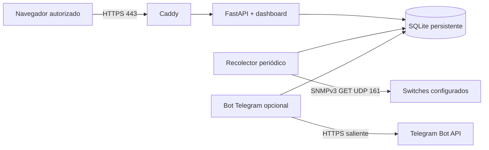

# Arquitectura del piloto

El recolector y el bot son tareas asíncronas del proceso del backend. La interfaz funciona aunque nadie tenga una sesión abierta: la recolección depende del servidor. Ejecutar una sola instancia de `app`; varios workers duplicarían los ciclos SNMP y competirían por las actualizaciones del bot.

El dashboard consulta `/api/overview` cada 15 segundos. El recolector genera lecturas cada 30 segundos por defecto. Refrescar el panel no aumenta la frecuencia de muestreo. Cada dato y cada respuesta del bot conserva la hora de su última lectura.

## API

Todas las rutas de datos y los archivos del dashboard requieren autenticación HTTP Basic detrás de HTTPS. `/healthz` es una señal de vida del proceso sin datos de inventario; no certifica que el recolector o Telegram estén conectados.

- `GET /api/overview`: inventario y estado actual, sin IP, configuración SNMP ni secretos.
- `GET /api/devices/{id}/history?hours=1`: muestras de un equipo (hasta 24 horas por consulta).
- `GET /api/events?hours=24`: eventos recientes y abiertos, hasta 500 registros.
- `POST /api/demo/telegram`: formateador del bot sin envío real, solo disponible en demo.

## Persistencia

SQLite WAL: estado por equipo, muestras indexadas por equipo/fecha, eventos y metadatos de offset Telegram. Se serializan escrituras mediante un bloqueo del proceso. El archivo de demo está separado del archivo live para impedir mezclar evidencia real con datos sintéticos.

Los contadores SNMP de 64 bits se conservan como enteros. Las tasas se calculan con el tiempo transcurrido entre dos lecturas válidas de la misma interfaz. Reinicios y discontinuidades invalidan el cálculo; los huecos quedan visibles. Una primera muestra no se representa como 0 Mbps.

## Próximas validaciones en campo

1. IP, firmware y rutas desde Ubuntu de cada switch.
2. Usuario SNMPv3 de lectura y algoritmos disponibles por firmware.
3. Lectura CBS350 de CPU/temperatura contrastada con su administración web.
4. Índice y sentido de la interfaz que transporta el tráfico que interesa.
5. Revisión documentada del aviso SG350 antes de habilitar Colón.
6. Umbrales térmicos propios del modelo y criterios operativos de alertas.
7. Confianza de certificados en los equipos cliente y acceso privado del bot.

Fuera del alcance actual: cambios de configuración en switches, descubrimiento automático, consultas PoE, alertas push, múltiples usuarios del panel, inventario editable por web, métricas de CPU/temperatura SG350 y operación redundante.
